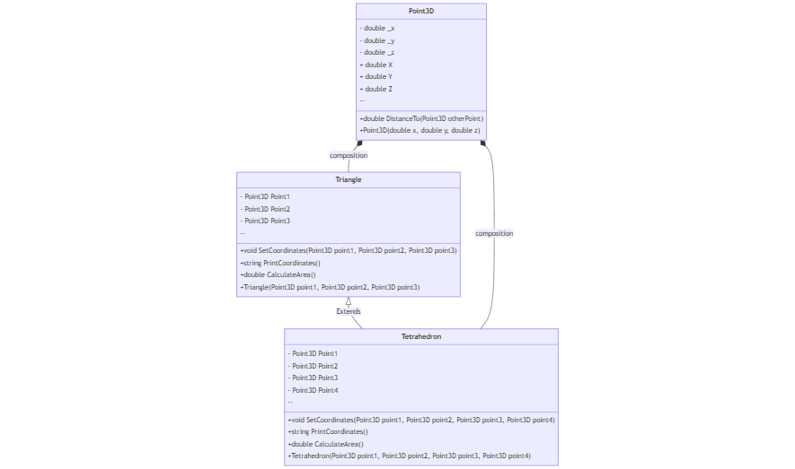

# Варіант №11

Завдання:

Описати клас „трикутник", який визначається координатами трьох точок на площині. 

    Створити відповідні методи:
    > задання координат трикутника;
    > виведення відповідних координат на екран;
    > обчислення площі трикутника.

Створити похідний від нього клас „тетраедр", який визначається координатами чотирьох точок у просторі.

    Перевантажити відповідні методи: 
    > задання координат вершин тетраедра;
    > виведення відповідних коефіцієнтів на екран;
    > обчислення об'єму тетраедра.

Створити об'єкти класів "трикутник" та "тетраедр". Обчислити площу трикутника та об'єм тетраедра.

## Використання/Приклади

```javascript
var triangle = new Triangle();
var tetrahedron = new Tetrahedron();

triangle.SetCoordinates(point1, point2, point3);
Console.WriteLine("Triangle: \n\n{triangle.PrintCoordinates()}");
Console.WriteLine("Area of the triangle: {triangle.CalculateArea():F2}");
        
tetrahedron.SetCoordinates(point1, point2, point3, point4);
Console.WriteLine("\nTetrahedron: \n\n{tetrahedron.PrintCoordinates()}");
Console.WriteLine("Volume of the tetrahedron: {tetrahedron.CalculateArea():F2}");
```


## UML діаграма


